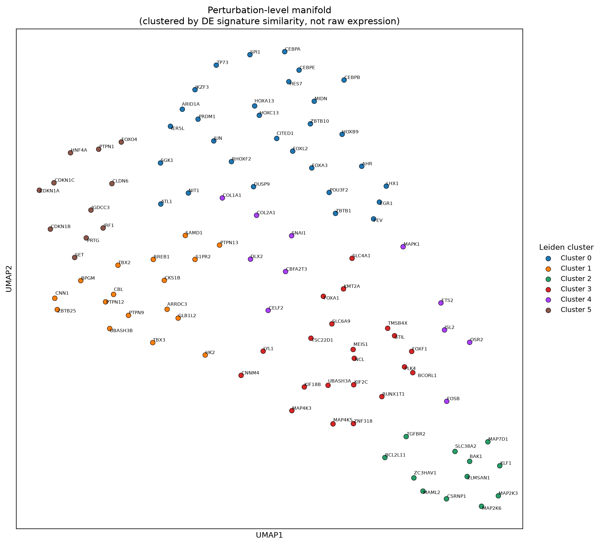

# Perturb-seq Reanalysis — Norman et al. 2019

A reprocessing of Norman et al. 2019 CRISPRa scRNA-seq data, to practice data QC, filtering, DE analysis, and hypothesis generation

**Source paper:** Norman et al., *Science* 2019, "Exploring genetic interaction manifolds constructed from rich single-cell phenotypes"
**Data:** [GSE133344](https://www.ncbi.nlm.nih.gov/geo/query/acc.cgi?acc=GSE133344)
**System:** CRISPRa activation of 105 single genes + combinatorial gene pairs in K562 cells, ~102,000 cells after QC

---

## Loading, QC, and guide parsing

Starting with Cell Ranger–filtered matrices available from GEO rather than raw FASTQ. Project focus is on Perturb-seq parameters and biological interpretation.
Standard filtering (pct mt, total cts, gene cts), CP10K normalization: 102,337 cells passing QC.
Used tsv available from publication to parse both CRISPRa guide identities per cell
105 single-gene targets were identified, matching count reported in the paper - data loading and parsing seems correct.

## On-target efficacy

Each CRISPRa guide should lead to upregulation of its target gene. There is significant heterogeneity in effect size, and notably many cells with guide detected but no change in expression levels. CRISPRa may not always be sufficient to drive strong expression (promoter/enhancer effects, heterogeneity in activation of other elements of transcriptional machinery)

Figure 1. On-target CRISPRa activation efficacy across the Norman et al. 2019 single-gene perturbation screen. Analysis restricted to the 102/105 single-gene CRISPRa targets present in the filtered gene set (n = 102,337 cells post-QC; guide assignment required good_coverage == True). For each target gene, log-normalized (CP10K, log1p) expression of that gene itself was compared between cells carrying its activating guide and the shared non-targeting control population (n = 10,990 cells).

(A) Distribution of log2 fold-change (target vs. control) across all single-gene targets. The distribution is overwhelmingly shifted positive (median log2FC = 2.08), consistent with the expected direction of effect for CRISPRa — the large majority of guides successfully increased expression of their intended target.

(B) Mean lognorm expression (± SEM) for the 15 strongest-activating targets, target vs. control, with a jittered subsample (n = 150 cells/group) overlaid to show within-group spread. Bar and plungers understate cell-to-cell heterogeneity in activation of target.

(C) Kernel density estimates of expression for the two strongest-activating genes and two genes closest to the screen's median log2FC, against the control distribution. Control's y-axis is clipped. Group sizes (n) are reported in the legend rather than encoded in curve height. Note that "median performer" genes show more cells with 0 change in target.

Note: statistical significance (Mann-Whitney U) was conducted; p ~0 for the majority of targets (75/102 genes had p = 0) irrespective of L2FC - not useful in ranking genes, here.

I also looked at whether activation strength related to how well-represented or how strongly-tagged (guide UMI count) a target was:

Figure 2. Screen-wide penetrance, statistical power, and guide dosage effects.

(A) Distribution of penetrance (fraction of a target's cells with expression above the control mean) across all 102 single-gene targets. Most targets show penetrance well below 1.0, confirming that a responder/non-responder split is warranted before downstream (perturbed vs ctrl-guide cells) DE analysis.

(B) L2FC vs. number of cells recovered per target gene (log-scaled x-axis, robust Theil-Sen fit). A positive slope (≈1 per log10 unit of cell count) indicates targets with more recovered cells tend to show larger L2FC - which suggests the data is robust (usually undersampling can lead to inflated L2FC)

(C) L2FC vs. mean guide-barcode UMI count per target cell (log-scaled x-axis, robust Theil-Sen fit). A positive slope (≈0.95) indicates that cells with more detected guide transcript show stronger target activation*

## DE: (1) standard single-cell Woilcoxon test (2) pseudobulk

(1) single-cell Wilcoxon test (each cell is a replicate, groups are CRISPRa-target and ctrl)
(2) pseudobulk (aggr counts per target (lanes are replicates) and run pyDESeq2)

padj is inflated in Wilcoxon at this many cells; comparing methods (both are standard) helps

Figure 3. Comparing single-cell (Wilcoxon) and pseudobulk (DESeq2) approaches to downstream perturbation DE.

(A) Jaccard overlap between each method's DEGs (padj < 0.05), computed per target (perturbation). 93 targets with sufficient data in both methods. Median overlap ≈0.31 — moderate agreement/dissonance (thousands of individual cells in Wilcoxon vs. 8 lanes ("replicates") in DESeq2).

(B) Gene-by-gene L2FC concordance for target/perturbation=KLF1. Red points are significant (padj < 0.05) in both Wilcoxon and pseudobulk DESeq2.

(C) DESeq2 pseudobulk: L2FC vs. mean normalized expression (baseMean, log scale) across all ~1.45M gene-target tests. Confirms that across all perturbations, low-expression genes show highly unstable, often extreme L2FC estimates regardless of padj, while higher-expression genes show progressively tighter, more reliable effect-size estimates.  lowly-detected genes have inflated L2FC, in positive direction - maybe because CRISPRa is likely to "occasionally induce gene count detection" for some genes with close to 0 counts in control. CRISPRi might resulted the inverted phenomenon: low basemean correlates with negative L2FC

Further validation - checked whether a target's own activation strength predicts how many downstream DEGs (below)

Figure 4. L2FC vs downstream DEG count. There is no correlation, consistent with publication. Here, Pearson R = -0.01, Theil-Sen slope = 3.37, n = 102

## Clustering and cell-state identification

With perturbation validated, moved to clustering and analysis.  Parent cell line is K562 (immortalized Hu leukemia), known to have multi-lineage differentiation potential. Used to study chronic myelogenous leukemia (CML), erythropoiesis, NK cell cytotoxicity.

sc.tl.ledien is analogous to FindClusters in Seurat. Both used to use Louvain rather than Leiden. Takes KNN graph and partitions into discrete communities.

Figure 5. Marker genes were identified using sc.tl.rank_genes_groups.  Top genes per cluster were fed into Enrichr via gseapy, compared to (1) PanglaoDB_Augmented_2021: curated cell-type marker sets and (2) GO_Biological_Process_2021: functional pway annotation.  High confidence labels from both were then manually inspected and clusters assigned names as in figure.  Some drivers of naming include: erythroid and myeloid-like differentiation programs, cell state (cell cycle, ribosomal/translation activity, mt content, IFN response).  Some enrichment results i.e. "T cell" marker match are interesting and not likely true - CRISPRa could have induced marker genes for T cells, driving in silico labeling

Figure 6. Technical and experimental covariates across UMAP space.

(A) UMAP colored by top 20 (by number of cells) single-gene CRISPRa target identity. Some perturbations drive a cluster, some result in expression profiles distributed across many.

(B) UMAP colored by perturbation type (control, single, double). No strong global segregation by perturbation type is expected if cell state is driven primarily by differentiation lineage rather than perturbation identity alone.

(C) UMAP colored by lane (gemgroup). No strong batch effects are observed.

(D) UMAP colored by pct mt.

(E) UMAP colored by total UMI count per cell (sequencing depth).

(F) UMAP colored by number of genes detected per cell (plotted independently from (E), as gene detection saturates at high depth).

(G) UMAP colored by pct ribosomal.

(H) UMAP colored by complexity score (log10 genes detected / log10 UMI count), flagging cells with low gene diversity relative to depth.

(I) UMAP colored by cell cycle phase (G1/S/G2M), scored via canonical S- and G2M-phase marker genes.

Figure 7. Though clustering and naming were done agnostic to perturbation_status, some targets drive cells to a particular cluster i.e. CRISPRa on CEBPA, B, and E result in cells classified as Myeloid-like 2.

Overall, classic technical artifacts such as sequencing depth, cell health/stress (pct mt, pct ribosomal), batch effects, and low-complexity cells seem negligible in this filtered dataset. Cell cycle phase shows some structure, consistent with some cluster naming by Enrichr being cell-cycle-driven.

Some CRISPRa targets seem to induce a progam of gene expression robust enough to influence the detection/assigning of cell-class, when clustering is performed on the entire dataset.

## Comparison of DE signatures across perturbations

Which perturbations result in similar global changes in gene expression?

Wilcoxon DE (target vs. control) per single CRISPRa target was run previously (above).  These results (L2FC and padj) were concatenated into one long-form table (gene × target are rows). Filtered for significant genes in at least 3 comparisons (padj < 0.05) — resulting in 4,602 genes. Pivoted to targets × genes (log2FC values, padj dropped), giving a ~105 × 4,602 signature matrix: one row per perturbation, DE by gene.

This was wrapped as an AnnData object so the standard scanpy pipeline (z-score, PCA, neighbors, UMAP, Leiden) could be repurposed for perturbations instead of cells. Resulting UMAP clusters perturbations by similarity of downstream DE — proximity reflects shared DE signature, not shared pathway membership or cell-state identity per se.

*Caveat:* padj was used only to select which genes enter the matrix, not to mask individual (target, gene) L2FC values — a gene can pass the filter via strong significance in one target and still contribute noisy, non-significant L2FC from other targets to the same matrix.

Figure 8.  Genes labeled on UMAP are CRISPRa perturbations; nearby points are perturbations that resulted in a similar DE signature across 4602 genes.

## Limitations

- The responder/non-responder split (used to restrict DE to likely-perturbed cells) is a simple expression threshold, not a formal mixture model (Mixscape in Seurat, Gaussian Mixture Models, scMAGeCK for CRISPRi or KO).
- Single-cell-level p-values throughout this project are inflated by pseudoreplication (treating cell gene counts as independent replicates when this is not true, vis-a-vis wet lab process to obtain data); effect sizes and pseudobulk cross-check are more trustworthy than padj.
- DE hits for low-expressed genes are lower confidence - direction of L2FC is worth following, but not magnitude.

## Next steps

- Genetic interaction modeling on the combinatorial (dual-guide) perturbations, following Norman et al. 2019's additive model to identify synergistic/buffering gene pairs
