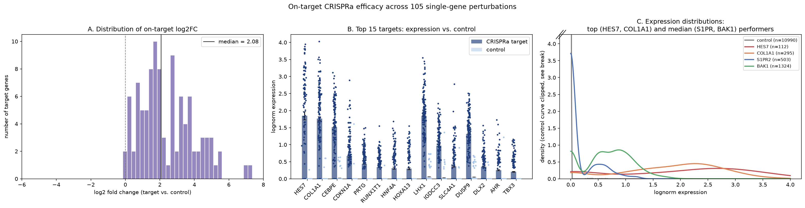
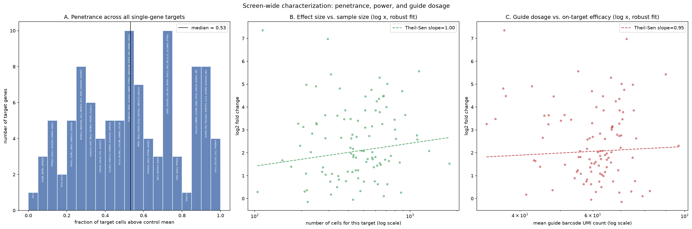
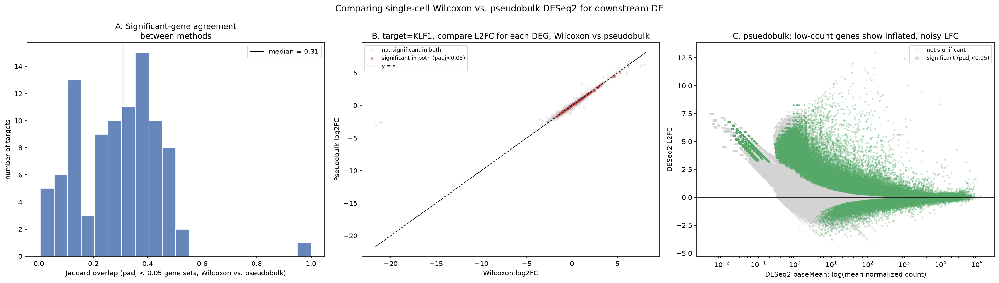
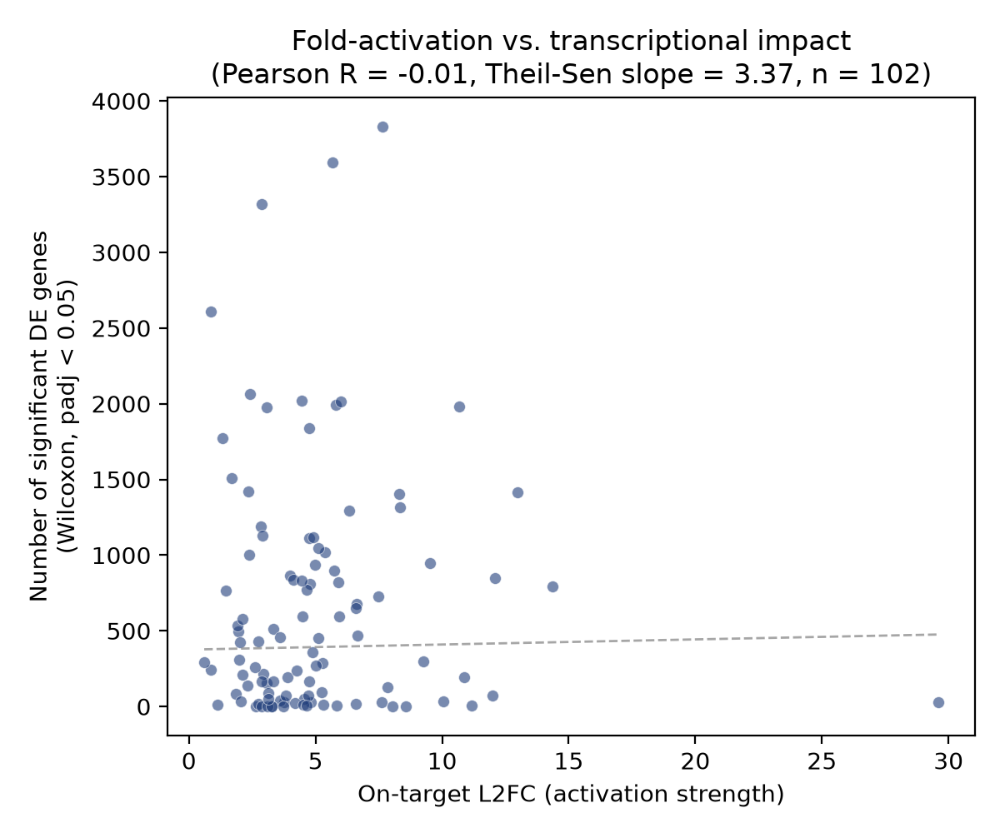
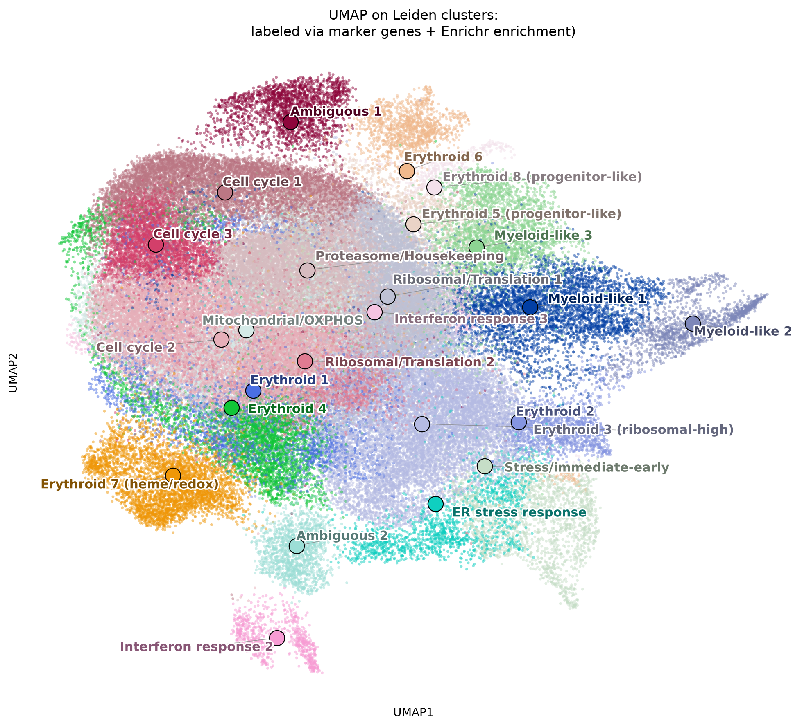

# Perturb-seq Reanalysis — Norman et al. 2019

A reprocessing of Norman et al. 2019 CRISPRa scRNA-seq data, to practice data QC, filtering, DE analysis, and hypothesis generation

**Source paper:** Norman et al., *Science* 2019, "Exploring genetic interaction manifolds constructed from rich single-cell phenotypes"
**Data:** [GSE133344](https://www.ncbi.nlm.nih.gov/geo/query/acc.cgi?acc=GSE133344)
**System:** CRISPRa activation of 105 single genes + combinatorial gene pairs in K562 cells, ~102,000 cells after QC

---

## Loading, QC, and guide parsing

Starting with Cell Ranger–filtered matrices available from GEO rather than raw FASTQ. Project focus is on Perturb-seq parameters and biological interpretation.
Standard filtering (pct mt, total cts, gene cts), CP10K normalization: 102,337 cells passing QC.
Used tsv available from publication to parse both CRISPRa guide identities per cell
105 single-gene targets were identified, matching count reported in the paper - data loading and parsing seems correct.

## On-target efficacy

Each CRISPRa guide should lead to upregulation of its target gene. There is significant heterogeneity in effect size, and notably many cells with guide detected but no change in expression levels. CRISPRa may not always be sufficient to drive strong expression (promoter/enhancer effects, heterogeneity in activation of other elements of transcriptional machinery)

*Figure 1. On-target CRISPRa activation efficacy across the Norman et al. 2019 single-gene perturbation screen. Analysis restricted to the 102/105 single-gene CRISPRa targets present in the filtered gene set (n = 102,337 cells post-QC; guide assignment required good_coverage == True). For each target gene, log-normalized (CP10K, log1p) expression of that gene itself was compared between cells carrying its activating guide and the shared non-targeting control population (n = 10,990 cells).

(A) Distribution of log2 fold-change (target vs. control) across all single-gene targets. The distribution is overwhelmingly shifted positive (median log2FC = 2.08), consistent with the expected direction of effect for CRISPRa — the large majority of guides successfully increased expression of their intended target.

(B) Mean lognorm expression (± SEM) for the 15 strongest-activating targets, target vs. control, with a jittered subsample (n = 150 cells/group) overlaid to show within-group spread. Bar and plungers understate cell-to-cell heterogeneity in activation of target.

(C) Kernel density estimates of expression for the two strongest-activating genes and two genes closest to the screen's median log2FC, against the control distribution. Control's y-axis is clipped. Group sizes (n) are reported in the legend rather than encoded in curve height. Note that "median performer" genes show more cells with 0 change in target.

Note: statistical significance (Mann-Whitney U) was conducted; p ~0 for the majority of targets (75/102 genes had p = 0) irrespective of L2FC - not useful in ranking genes, here.*

I also looked at whether activation strength related to how well-represented or how strongly-tagged (guide UMI count) a target was:

*RFigure 2. Screen-wide penetrance, statistical power, and guide dosage effects.

(A) Distribution of penetrance (fraction of a target's cells with expression above the control mean) across all 102 single-gene targets. Most targets show penetrance well below 1.0, confirming that a responder/non-responder split is warranted before downstream (perturbed vs ctrl-guide cells) DE analysis.

(B) L2FC vs. number of cells recovered per target gene (log-scaled x-axis, robust Theil-Sen fit). A positive slope (≈1 per log10 unit of cell count) indicates targets with more recovered cells tend to show larger L2FC - which suggests the data is robust (usually undersampling can lead to inflated L2FC)

(C) L2FC vs. mean guide-barcode UMI count per target cell (log-scaled x-axis, robust Theil-Sen fit). A positive slope (≈0.95) indicates that cells with more detected guide transcript show stronger target activation*

## DE: (1) standard single-cell Woilcoxon test= (2) pseudobulk

(1) single-cell Wilcoxon test (each cell is a replicate, groups are CRISPRa-target and ctrl)
(2) pseudobulk (aggr counts per target (lanes are replicates) and run pyDESeq2)

padj is inflated in Wilcoxon at this many cells; comparing methods (both are standard) helps

*Figure 3. Comparing single-cell (Wilcoxon) and pseudobulk (DESeq2) approaches to downstream perturbation DE.

(A) Jaccard overlap between each method's DEGs (padj < 0.05), computed per target (perturbation). 93 targets with sufficient data in both methods. Median overlap ≈0.31 — moderate agreement/dissonance (thousands of individual cells in Wilcoxon vs. 8 lanes ("replicates") in DESeq2).

(B) Gene-by-gene L2FC concordance for target/perturbation=KLF1. Red points are significant (padj < 0.05) in both Wilcoxon and pseudobulk DESeq2.

(C) DESeq2 pseudobulk: L2FC vs. mean normalized expression (baseMean, log scale) across all ~1.45M gene-target tests. Confirms that across all perturbations, low-expression genes show highly unstable, often extreme L2FC estimates regardless of padj, while higher-expression genes show progressively tighter, more reliable effect-size estimates.  lowly-detected genes have inflated L2FC, in positive direction - maybe because CRISPRa is likely to "occasionally induce gene count detection" for some genes with close to 0 counts in control. CRISPRi might resulted the inverted phenomenon: low basemean correlates with negative L2FC*

Further validation - checked whether a target's own activation strength predicts how many downstream DEGs (below)

*Figure 4. L2FC vs downstream DEG count. There is no correlation, consistent with publication. Here, Pearson R = -0.01, Theil-Sen slope = 3.37, n = 102*

## Clustering and cell-state identification

With perturbation validated, moved to clustering and analysis.  Parent cell line is K562, known to have multi-lineage differentiation potential.

*Leiden clustering recovers clear erythroid and myeloid-like differentiation programs, alongside several clusters driven by cell state rather than lineage identity (cell cycle, ribosomal/translation activity, mitochondrial content, interferon response) — a common feature of single-cell data that's worth separating out rather than mislabeling as biological lineages. Cluster identities were assigned using marker genes and Enrichr gene-set enrichment, manually reviewed rather than taken from the single top automated hit — some enrichment results (like a "T cell" marker match in a dataset with no T cells) turned out to be artifacts of shared cell-cycle genes across unrelated marker-gene-set entries, which was a useful reminder not to trust automated annotation blindly.*

## Limitations

- The responder/non-responder split (used to restrict DE to likely-perturbed cells) is a simple expression threshold, not a formal mixture model — a reasonable heuristic, but not a validated classifier.
- Single-cell-level p-values throughout this project are inflated by pseudoreplication; effect sizes and the pseudobulk cross-check are more trustworthy than raw significance.
- Low-expression DE hits should be read for direction, not precise magnitude.

## Next steps

- Genetic interaction modeling on the combinatorial (dual-guide) perturbations, following the paper's additive model to identify synergistic/buffering gene pairs
- Perturbation-level manifold analysis — asking which perturbations enrich which of the cell states identified here, extending the per-cell clustering above into the paper's per-perturbation framing